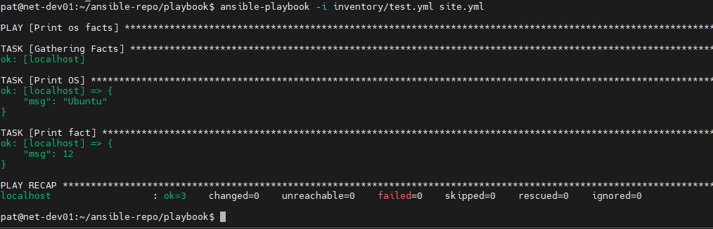
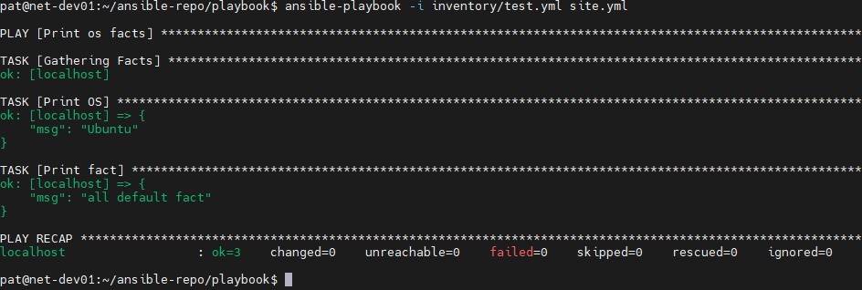
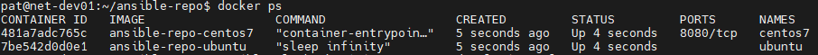
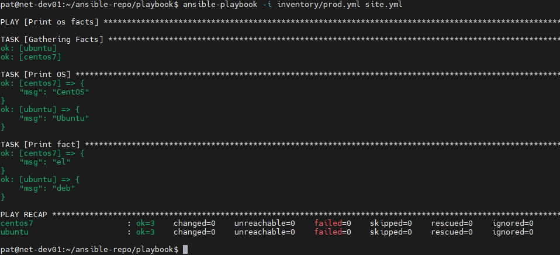

# Домашнее задание к занятию 1 «Введение в Ansible»

## Задание 1

### Условие ответа:

> Попробуйте запустить playbook на окружении из test.yml, зафиксируйте значение, которое имеет факт some_fact для указанного хоста при выполнении playbook.

### Ответ:

---
## Задание 2

### Условие ответа:

> Найдите файл с переменными (group_vars), в котором задаётся найденное в первом пункте значение, и поменяйте его на all default fact.

### Ответ:

---
## Задание 3

### Условие ответа:

> Воспользуйтесь подготовленным (используется docker) или создайте собственное окружение для проведения дальнейших испытаний.

### Ответ:

---
## Задание 4

### Условие ответа:

> Проведите запуск playbook на окружении из prod.yml. Зафиксируйте полученные значения some_fact для каждого из managed host.

### Ответ:

